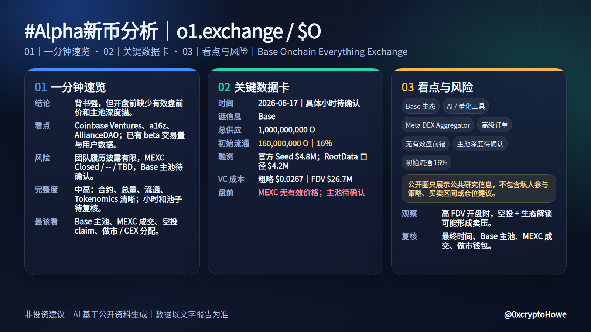
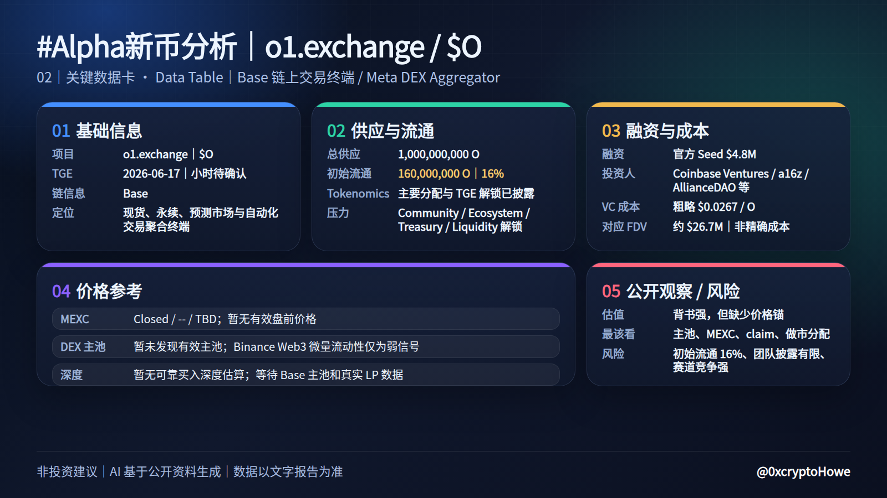
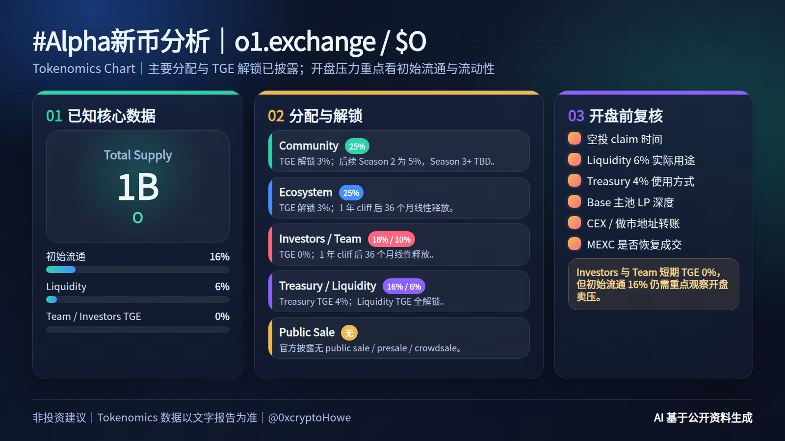

# O / o1.exchange 完整示例输出（2026-06-17）

> 示例用于展示 `bn-alpha-research` 的完整输出形态：文字报告 + `summary_dashboard` + `data_table` + `tokenomics_chart`。示例基于 2026-06-17 前后公开资料整理，链上数据、池子深度、上线时间与融资信息会随时间变化；真实调研时必须重新核验来源。







```text
#Alpha新币分析｜o1.exchange / O

> 本 BN 新币调研 Skill 由 [@0xcryptoHowe](https://x.com/0xcryptoHowe) 制作，欢迎关注反馈！


【01｜一分钟速览】
说明：以下为 AI 基于公开资料生成的研究摘要，不代表作者本人建议，也不构成投资建议。
一句话结论：o1.exchange 是 Base 上的链上交易终端 / Meta DEX Aggregator，背书较强，但开盘前缺少有效盘前价和主池深度锚。
核心看点：Coinbase Ventures、a16z、AllianceDAO 等投资人背书；官方披露已有 beta 交易量、交易笔数和用户注册数据。
最大风险：团队公开履历披露有限，MEXC 当前无有效盘前成交，DEX 主池也未形成可靠价格锚。
数据完整度：中高；合约、总量、初始流通和 Tokenomics 较清晰，具体小时与池子深度仍待开盘前复核。
开盘前最该看：Base 主池是否出现有效流动性、Alpha / Binance Web3 是否更新具体时间、MEXC 是否恢复真实成交。

【02｜关键数据卡】
基础信息：
- 项目：o1.exchange / $O
- 时间：2026-06-17，具体小时待 Alpha / Binance Web3 最终确认
- 链信息：Base
- 定位：Onchain Everything Exchange，聚合现货、永续、预测市场和自动化交易工具

供应与流通：
- 总供应：1,000,000,000 O
- 初始流通：160,000,000 O｜16%
- Tokenomics：已披露主要分配和 TGE 解锁
- 主要释放压力：Community / Ecosystem / Treasury / Liquidity 的 TGE 解锁与空投领取节奏

融资与成本：
- 融资：官方披露 Seed $4.8M；RootData 口径 $4.2M，存在差异
- 核心投资人：Coinbase Ventures、a16z、AllianceDAO、The House Fund、Amber Group 等
- 粗略 VC 成本：约 $0.0267 / O（按 $4.8M / Investors 18% 粗算）
- 对应 FDV：约 $26.7M；仅作粗略锚，不是精确成本

价格参考：
- MEXC 盘前：Closed / -- / TBD；暂无有效价格参考
- DEX 主池：暂未发现有效主池；Binance Web3 微量流动性仅作弱信号
- 买入深度：暂无可靠估算，需等待 Base 主池和真实 LP 深度

公开观察：
- 估值状态：暂无法判断，背书强但缺少盘前 / 池子价格锚
- 开盘前最该看：Base 主池、MEXC 成交、空投 claim、做市 / CEX 分配

风险标签：
- 无有效盘前价
- 主池深度待确认
- 团队履历披露有限
- 初始流通 16% 带来开盘卖压
- DEX 聚合器 / 交易终端赛道竞争激烈

【03｜完整调研内容】

一、项目概况
- 项目：o1.exchange｜[@o1_exchange](https://x.com/o1_exchange)
- Token：$O
- 开盘 / TGE：CMC 显示 First Listing Date 为 2026-06-17，官方白皮书也写 TGE: June 17, 2026；Alpha123 当时显示 O / o1 exchange，但具体小时为「待公布」。
- 定位：o1.exchange 是一个 Base 主链上的 Onchain Everything Exchange，聚合现货、永续、预测市场和交易自动化工具。

二、合约地址与链上信息
官方合约：
- Base：0x182fa643e5f29d5eca75e7b9cf9336a3fe4620b2
  Explorer：[BaseScan](https://basescan.org/token/0x182fa643e5f29d5eca75e7b9cf9336a3fe4620b2)
- Binance Web3 Token 页：[O / o1.exchange](https://web3.binance.com/en/token/base/0x182fa643e5f29d5eca75e7b9cf9336a3fe4620b2)
- Coinbase Markets 已确认该 Base 合约地址：[Coinbase Markets](https://x.com/CoinbaseMarkets/status/2060033738503835800)

链上核验：合约已部署在 Base，name = o1.exchange，symbol = O，decimals = 18，totalSupply = 1,000,000,000 O。暂未发现官方 BSC CA；本次应按 Base ERC-20 处理，不要因为是 EVM 地址就强行套 BSC。

三、基本面与叙事
o1.exchange 的叙事是「链上交易终端 + Meta DEX Aggregator + AI / 量化交易工具」。项目把 Base、Solana、BNB Chain 上的现货交易、永续、预测市场聚合到一个交易界面里，主打聚合流动性、高级订单、实时分析、策略构建、回测和 PnL 追踪。

官方披露有两组产品数据口径：
- Disclosure：7 个月 beta 内 $180M+ spot volume、3M+ transactions、400k+ signups。
- Whitepaper：$220M+ spot volume、3M+ transactions、400k+ signups。

结论：项目不是纯空气叙事，已有交易终端和公开数据披露；但 DEX 聚合器 / 交易终端赛道竞争激烈，长期估值需要真实交易量、留存、交易深度和用户付费能力继续验证。

四、Tokenomics 与流通情况
Tokenomics：
- 总量：1,000,000,000 O｜官方 Disclosure / CMC
- 初始流通：160,000,000 O｜16%
- Community：25%｜TGE 解锁 3%，后续 Season 2 为 5%，Season 3+ TBD
- Ecosystem：25%｜TGE 解锁 3%，1 年 cliff 后 36 个月线性释放
- Investors：18%｜TGE 0%，1 年 cliff 后 36 个月线性释放
- Team：10%｜TGE 0%，1 年 cliff 后 36 个月线性释放
- Treasury：16%｜TGE 解锁 4%，剩余多签控制
- Liquidity：6%｜TGE 全解锁，用于 CEX / DEX 初始流动性
- Public Sale：官方披露没有 public sale / presale / crowdsale

开盘压力观察：初始流通 16% 不算极低；Investors 和 Team 都是 TGE 0% 解锁，短期开盘 VC 直接卖压较小。真正需要盯的是 Community 3%、Ecosystem 3%、Treasury 4%、Liquidity 6% 的实际使用方式，以及空投领取 / 做市 / CEX 分配细节。

五、团队背景
官方披露：
- Founder：Jerry Pan
- Director：Claudio Romildo Pezzia
- Company：MoonX Foundation，Cayman Islands

RootData 额外显示：
- RootData 项目页将 o1.exchange 标为 AI-powered DEX trading，标签为 DeFi / DEX / AI，并显示地点 Palo Alto。
- RootData 搜索结果中还出现 stambouli 为 Co-founder and CEO、Archer 为 Head of Growth，但官方 Disclosure / Whitepaper 的核心团队披露主要是 Jerry Pan 与 Claudio Romildo Pezzia。

团队判断：团队公开履历披露偏有限，LinkedIn 履历暂无法完整核验。优点是官方披露了实体、核心人员、代币分配和投资方；风险是 founder 过往 crypto-native 履历公开材料不够充分，团队强度仍需通过产品数据和投资方背书侧面验证。

六、融资背景与 VC 成本推算
融资情况：
- Seed：官方披露 $4.8M
- 投资人：Coinbase Ventures、a16z、AllianceDAO、The House Fund、Amber Group、30+ angels / institutional investors
- 来源：官方 Disclosure / 官方 Whitepaper
- RootData API 显示 total_funding 为 $4.2M，与官方 $4.8M 有差异；此处以官方披露为高优先级，RootData 作为交叉参考。

VC 成本：
- 可计算性：粗略
- 假设口径：若 $4.8M seed 对应 Investors 18% 全部分配，即 180,000,000 O
- 粗略成本：$4.8M / 180M O ≈ $0.0267 / O
- 对应 FDV：约 $26.7M
- 若按 RootData $4.2M 口径粗算：$0.0233 / O，对应 FDV 约 $23.3M
- 限制：官方未披露 seed 轮 token FDV / valuation，也未明确 $4.8M 是否完全对应 18% investor token allocation；因此只能作为粗略 VC 成本锚，不是精确成本。

融资质量判断：Coinbase Ventures + a16z + AllianceDAO 的组合较强，背书质量高于普通 Alpha 新币。但 investor allocation 18% 且 1 年 cliff，长期仍有解锁压力；短线开盘主要看流通盘、空投行为和流动性结构。

七、盘前价 / 池子价
盘前 / 池子：
- MEXC：直接页 MEXC Pre-Market O 显示 Closed，bid / ask / 24H Volume / Total Volume 均为 --，Trading Period / Settlement Time 为 TBD；暂无有效盘前价格。
- CoinCarp：显示 MEXC Pre-Market 于 2026-06-08 14:00 UTC 开启过，但当前 MEXC 页面无有效成交数据；参考价值低。
- Dexscreener：按合约查询暂无有效 pairs。
- GeckoTerminal：按 Base / BSC 查询未拿到有效池子数据。
- Binance Web3 Token 页：显示极小流动性和少量 holders，属于弱链上流动性信号，不应作为可靠池子价。

结论：暂未发现已添加有效流动性的主池；开盘前需继续盯 Binance Web3 / BaseScan / DEX aggregators 是否出现正式池子和有效深度。

八、估值与开盘观察
公版不放具体交易区间，只给估值观察：
- 初始流通 16%，流通盘不算特别低；若市场给高 FDV，空投和生态流通部分可能形成较强卖压。
- VC 粗略成本锚在约 $23M–27M FDV，但因无明确 token valuation，只能作为低位参考。
- 项目背书较强，Coinbase Ventures / a16z / AllianceDAO 组合会提高市场关注度。
- 叙事上「AI + onchain trading terminal + Base ecosystem」有热度，但 DEX terminal / aggregator 的护城河需要真实交易量持续验证。
- 当前没有可靠 MEXC 盘前价和 DEX 池子价，临开盘前价格发现信息不足，不适合提前下强结论。

九、主要风险
- 官方与 RootData 融资金额有差异，需以官方为准但保留口径差异。
- 团队公开履历披露有限，LinkedIn 履历暂未完整核验。
- 初始流通 16%，空投 + 生态 + 流动性 + Treasury TGE 合计会带来开盘流通压力。
- 暂无有效 MEXC 盘前成交和 DEX 主池深度，开盘价格可能波动很大。
- Base CA 已确认，但 Binance Alpha 具体空投 / 开盘小时仍待公布。
- DEX aggregator / 交易终端赛道竞争激烈，长期估值要看真实交易量和留存。
- Staking / revenue-sharing eligibility 表述较敏感，官方也强调 $O 不代表 equity / debt / profit-sharing rights。

十、开盘前观察重点
- Alpha123 / Binance Alpha 是否更新具体 UTC+8 时间。
- Base 官方合约是否在 Binance Alpha / Binance Web3 页面持续一致。
- MEXC 是否重新开放有效 pre-market，并出现真实成交量。
- Base 上是否出现 Uniswap / Aerodrome / 其他有效主池。
- 初始池子 FDV、流动性、单边池 / 双边池结构。
- 空投 claim 时间、是否与交易开放同一时间。
- CEX 钱包 / 做市地址是否出现明显转账，但需标记为链上观察，不等于官方上线确认。

免责声明：以上内容仅为个人研究记录，不构成任何投资建议。新币开盘波动较大，请自行判断风险。
```
